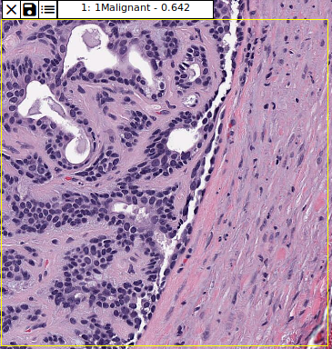
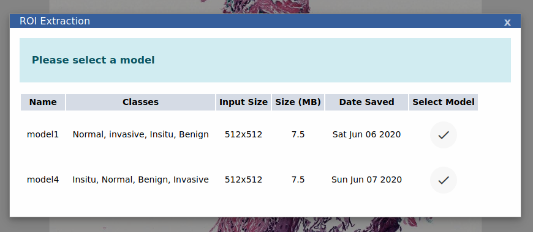
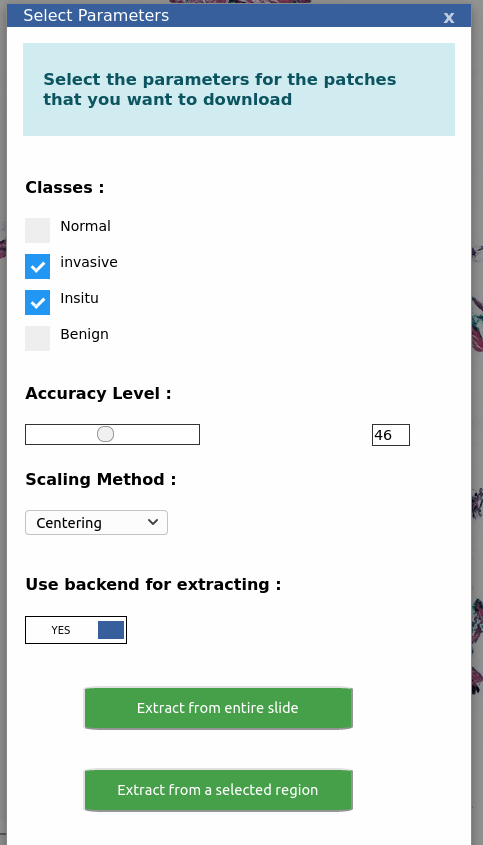

# Model App

## Prediction

> Allows testing classification models


### Example usage


Clicking the plus icon will allow adding a Keras/tensorflowjs trained model.

Select the desired model from the dropdown.

Next, zoom in to an area that you would like to predict and select the required area.



The result box shows the class with maximum average probability taken across all the patches. Clicking the Save as CSV button will save the probabilities of all the classes along with the patch coordinate from the top left corner as a .csv [file](assets/eg.csv).


## Region of Interest (roi) Extraction

> Allows downloading patches from current slide according to given criteria by applying a classification model


### Example usage 


Clicking on the roi button opens a window to choose a model from the available ones. Select a desired model .



Now , choose the parameters according to which the patches will be downloaded from the nexxt menu . You can also use ``` use backend for extracting ``` option to do the processing in the local machine instead of the browser in case of large slides




Next, choose if you want to download patches from the complete slide or from a selected region. If you want to download from a selected region , select the region next. After this the prediction and extraction process will begin . Once finished you'll be prompted to download the patches on your local computer. 


